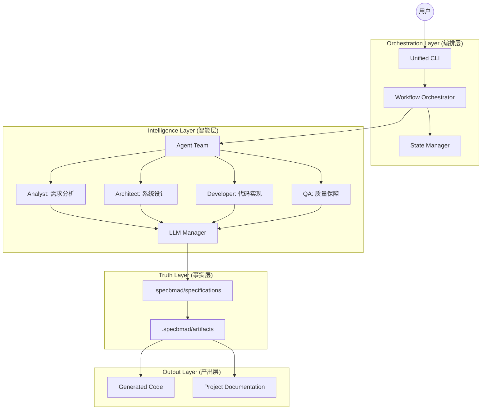

# SpecKit-BMAD 项目架构设计

SpecKit-BMAD 是一个基于 **规格驱动开发 (Spec-Driven Development, SDD)** 和 **BMAD 协同方法论** 的自动化软件工程框架。它通过多 Agent 协作，实现从自然语言需求到可运行产物的全生命周期管理。

## 1. 核心架构图 (Conceptual Architecture)



## 2. 核心组件说明

### 2.1 编排层 (Orchestration)
- **Unified CLI**: 统一的入口，通过 `go` 命令实现“一键生成”，屏蔽底层复杂性。
- **Workflow Orchestrator**: 核心状态机，定义了不同场景（如 `full-development`, `change-management`）的执行步骤和依赖关系。

### 2.2 智能层 (Intelligence)
- **Agent Team**: 采用角色分工模式。每个 Agent 都有特定的 System Prompt 和工具集。
- **LLM Manager**: 统一的 LLM 调用接口，支持 OpenAI, Claude 及 Mock 模式，具备自动重试、并发控制和缓存功能。

### 2.3 事实层 (Truth)
- **Specifications (规格)**: 这是系统的 **唯一真理来源**。所有代码和测试都必须基于 `.specbmad/specifications/` 中的 Markdown 文档生成。
- **Change Management**: 基于 OpenSpec 理念，通过 `change-proposal` 实现对规格的增量更新。

### 2.4 产出层 (Output)
- **Generated Code**: 支持多语言（TS, Python, C++, Java）的脚手架和业务逻辑生成。
- **Artifacts**: 包含分析报告、设计图、测试报告等中间产物。

## 3. 目录结构

```text
src/
├── agents/         # 各角色 Agent 实现 (Analyst, Developer, etc.)
├── commands/       # CLI 命令定义 (go, change, config, etc.)
├── core/           # 核心引擎 (LLM, Workflow, Change, Doctor)
├── generator/      # 模板引擎与代码生成逻辑
├── types/          # 全局类型定义
└── utils/          # 工具类 (Logger, Config, Paths)
```

## 4. 技术栈
- **Runtime**: Node.js (TypeScript)
- **LLM**: OpenAI (GPT-4o), Anthropic (Claude 3.5)
- **CLI**: Commander.js
- **Configuration**: YAML / JSON
- **Documentation**: Markdown
