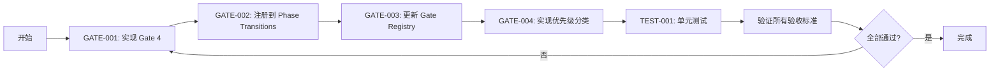

# SpecBmad v2 架构对齐改造计划

**生成时间**: 2026-01-21
**基于**: spec_bmad_unified_architecture_v_2_frozen_edition.md
**策略**: 最小可行路径（Strategy A）

---

## 执行摘要

本计划按照 **v2.2 冻结版架构规范** 对 SpecBmad 项目进行改造，确保系统完全符合"受 Phase 约束、以 Spec 为法律、以验证为门禁的 AI 工程运行时"要求。

---

## 架构分析总结

### ✅ 已正确实现

| 组件 | 状态 | 符合规范 |
|-------|------|----------|
| Phase Controller | 🟢 优秀 | ✅ Section 2, 6.1.9 |
| Event Store | 🟢 优秀 | ✅ Section 6.1.6, 6.1.11 |
| Gate Registry | 🟢 优秀 | ✅ Section 6.1.9 |
| Phase Transitions YAML | 🟢 优秀 | ✅ Section 6.1.9 |
| Python Bridge | 🟢 优秀 | ✅ Section 4, 5 |
| 性能指标追踪 | 🟢 优秀 | ✅ Section 6.1.3 |
| Spec/Execution 域边界 | 🟢 优秀 | ✅ Section 4, 5 |

### 🔴 架构违规/缺失

| 问题 | 位置 | 严重性 | 章节 |
|-----|------|--------|------|
| **Gate 4: Non-Functional Gates 未实现** | `src/core/phase/gates.ts` | 高 | 6.1.12 |
| **PerformanceGateChecker 缺失** | `src/core/phase/gates.ts` | 高 | 6.1.12 |
| **StabilityGateChecker 缺失** | `src/core/phase/gates.ts` | 高 | 6.1.12 |
| **Gate 优先级分类逻辑缺失** | `src/core/phase/controller.ts` | 中 | 6.1.12 |

---

## P0 - 阻塞性任务（策略 A）

### GATE-001: 实现 Gate 4: Non-Functional Gates

**文件**: `src/core/phase/gates/performance-gate.ts` (新建)
**优先级**: P0
**预计时间**: 3 小时
**依赖**: 无

**需求**（Section 6.1.12）:
- 实现 `PerformanceGateChecker` 类
- 监控 LLM P95 延迟
- 实现 `StabilityGateChecker` 类
- 监控 Event Store 可用性
- 实现 Gate 优先级分类逻辑
- 功能 Gate 失败：自动回退并阻断
- 稳定性 Gate 失败：可降级但必须记录
- 性能 Gate 失败：仅记录与通知，不阻断

**验收标准**:
- ✅ `PerformanceGateChecker` 实现并通过测试
- ✅ `StabilityGateChecker` 实现并通过测试
- ✅ Gate 按优先级正确分类
- ✅ 性能 Gate 不阻塞 Phase
- ✅ 稳定性 Gate 支持降级
- ✅ 所有 Gate 在 `phase_transitions.yaml` 中注册

---

### GATE-002: 注册非功能 Gate 到 Phase Transitions

**文件**: `spec/phase_transitions.yaml`
**优先级**: P0
**预计时间**: 0.5 小时
**依赖**: GATE-001

**需求**:
- 在 Phase 3 添加 `performance_warning` Gate
- 在 Phase 4 添加 `stability_check` Gate
- 确保 Gate 优先级符合规范

**验收标准**:
- ✅ 非功能 Gate 在 Phase 3/4 中注册
- ✅ YAML 格式正确
- ✅ Phase Controller 正确加载并执行

---

### GATE-003: 更新 Gate Registry

**文件**: `src/core/phase/gates.ts`
**优先级**: P0
**预计时间**: 1 小时
**依赖**: GATE-001, GATE-002

**需求**:
- 导入并注册 `PerformanceGateChecker`
- 导入并注册 `StabilityGateChecker`
- 更新 `registerDefaultGates()` 函数

**验收标准**:
- ✅ 非 Gate 正确注册
- ✅ 注册时不抛出错误
- ✅ Gate 可被 Phase Controller 调用

---

### GATE-004: 实现 Gate 优先级分类逻辑

**文件**: `src/core/phase/controller.ts`
**优先级**: P0
**预计时间**: 2 小时
**依赖**: GATE-003

**需求**（Section 6.1.12.1）:
- 实现 Gate 分类：功能 Gate > 稳定性 Gate > 性能 Gate
- 功能 Gate 失败：自动回退并阻断
- 稳定性 Gate 失败：可降级但必须记录
- 性能 Gate 失败：仅记录与通知

**验收标准**:
- ✅ Gate 按优先级正确处理
- ✅ 阻断行为符合规范
- ✅ 降级行为符合规范
- ✅ 记录行为符合规范

---

## 测试计划

### TEST-001: Gate 4 单元测试

**文件**: `tests/core/phase/performance-gate.test.ts` (新建)
**优先级**: P2
**预计时间**: 3 小时
**依赖**: GATE-001

**测试用例**:
- PerformanceGateChecker 正常情况（通过）
- PerformanceGateChecker P95 超阈值
- StabilityGateChecker 正常情况（通过）
- StabilityGateChecker Event Store 不可用
- Gate 优先级分类测试

**验收标准**:
- ✅ 所有测试用例通过
- ✅ 测试覆盖率 > 90%

---

## 文件清单

### 需要创建的文件

| 文件 | 目的 | 大小估计 |
|------|------|----------|
| `src/core/phase/gates/performance-gate.ts` | 实现 Gate 4 | ~150 行 |
| `tests/core/phase/performance-gate.test.ts` | Gate 4 测试 | ~200 行 |

### 需要修改的文件

| 文件 | 修改内容 | 行数估计 |
|------|----------|----------|
| `src/core/phase/gates.ts` | 注册 Gate 4 | +20 行 |
| `src/core/phase/controller.ts` | Gate 优先级分类 | +50 行 |
| `spec/phase_transitions.yaml` | 添加非功能 Gate | +10 行 |

---

## 风险评估

| 风险 | 影响 | 缓解措施 |
|------|------|----------|
| Gate 4 实现复杂 | 高 | 参考现有 Gate 实现（OpenSpecGateChecker） |
| 性能监控不准确 | 中 | 使用 Event Store 中的现有 LLM metrics |
| Phase 迁移逻辑复杂 | 中 | 充分测试，保持向后兼容 |

---

## 执行顺序

---

## 参考章节

- **Section 6.1.12**: Gate 4: Non-Functional Gates（非功能性门禁分级）
- **Section 6.1.9**: Gate 1: Phase Transition Contract（Phase 迁移契约）
- **Section 6.2**: 测试方案（冻结）

---

**文档版本**: v1.0
**状态**: 策略 A（最小可行路径）
