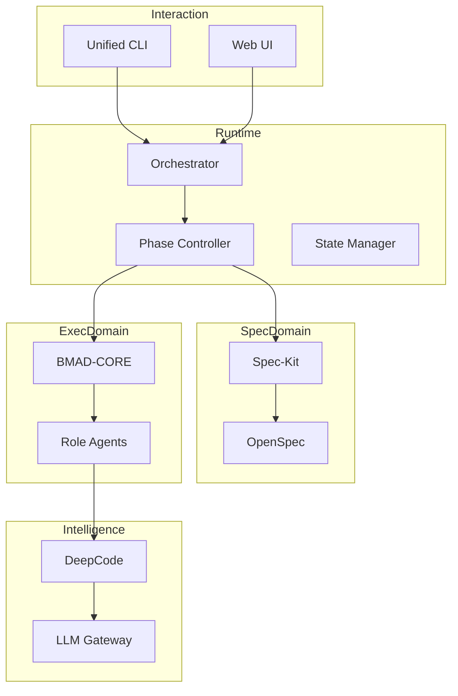
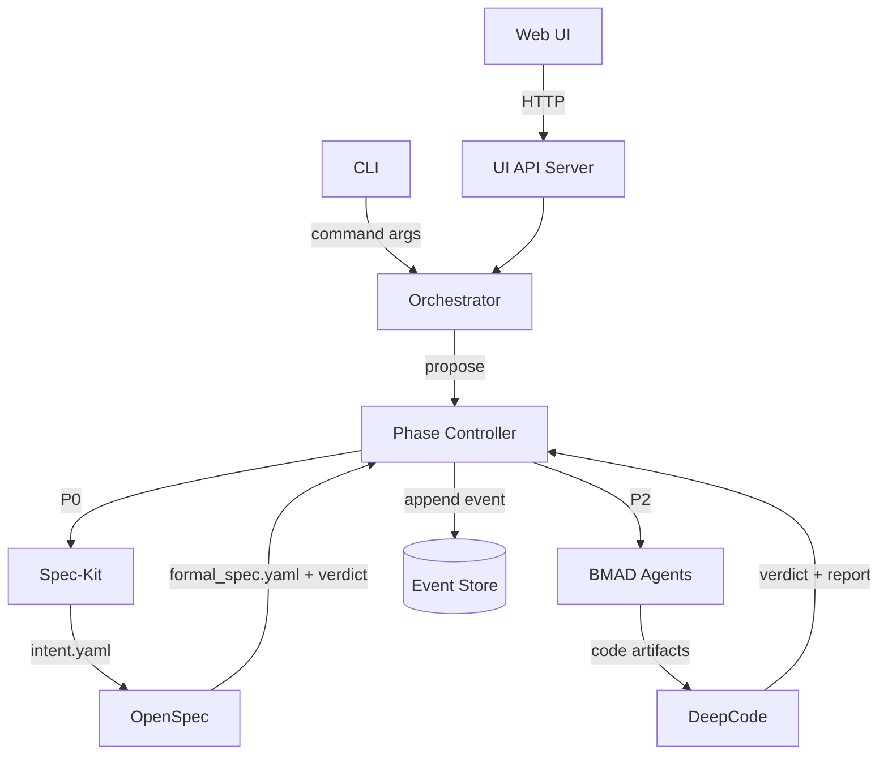
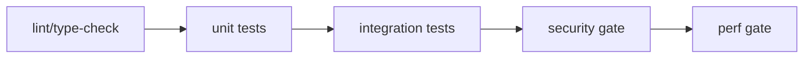

# SpecBmad Unified Architecture v2

## （冻结版 · 可直接执行）

> **状态**：FROZEN
> 
> **版本**：v2.2
> 
> **修订日期**：2026-01-03
>
> 本文档定义 SpecBmad 项目的**最终架构形态、权力结构与工程边界**。自本版本起：
> - 不再讨论“是否这样设计”
> - 只讨论“如何按此设计实现”

---

## 1. 最高设计原则（不可违背）

1. **Spec First（规范先于一切）**  
   - 没有 Spec，不允许进入 Phase 2+
2. **Phase 是系统主权**  
   - 一切执行、代理、工具必须服从 Phase Controller
3. **执行域不可反向污染规范域**  
   - Node.js 永远不能修改 Spec
4. **验证不是工具，是门禁（Gate）**  
   - DeepCode / OpenSpec 具备否决权

---

## 2. Phase 0–5 强约束状态机（冻结定义）

### Phase 0 — Intent Capture
- **负责人**：Spec-Kit
- **输入**：自然语言需求
- **输出**：`intent.yaml`
- **禁止**：
  - 架构设计
  - 任何代码生成

---

### Phase 1 — Formal Specification
- **负责人**：OpenSpec
- **输入**：`intent.yaml`
- **输出**：`formal_spec.yaml`
- **能力**：
  - 不变量（Invariants）
  - 前置 / 后置条件
- **Phase Gate**：
  - 未通过 OpenSpec 校验 → 不允许进入 Phase 2

---

### Phase 2 — Architecture & Planning
- **负责人**：BMAD (PM / Architect)
- **输入**：`formal_spec.yaml`
- **输出**：
  - `architecture.md`
  - `plan.yaml`
- **约束**：
  - 只读 Spec

---

### Phase 3 — Implementation
- **负责人**：BMAD-DEV
- **并行裁判**：DeepCode
- **输出**：`/code`
- **Phase Gate（冻结）**：
  - 所有代码 **必须通过 DeepCode 语义校验**

---

### Phase 4 — Verification
- **负责人**：OpenSpec + DeepCode
- **输出**：`verification_report.md`
- **能力**：
  - Spec 覆盖率
  - 语义一致性

---

### Phase 5 — Iteration / Evolution
- **负责人**：Phase Controller
- **输入**：Event Store
- **结果**：
  - 回退至 Phase 1 或 Phase 3

---

## 3. 权力结构矩阵（最终裁决）

| 模块 / 角色 | 推进 Phase | 阻断 Phase | 修改 Spec | 修改 Code |
|-----------|-----------|-----------|-----------|-----------|
| CLI / UI | ❌ | ❌ | ❌ | ❌ |
| BMAD Agent | ❌ | ❌ | ❌ | ✅ |
| Orchestrator | 提议 | ❌ | ❌ | ❌ |
| **OpenSpec** | ❌ | ✅ | ✅ | ❌ |
| **Phase Controller** | ✅ | ✅ | ❌ | ❌ |
| **DeepCode** | ❌ | ✅（P3/P4） | ❌ | ❌ |

> ⚠️ 本表为**不可修改条款**

---

## 4. 域划分与语言边界（冻结）

### 4.1 Spec Domain（Python）

- 组件：
  - Spec-Kit
  - OpenSpec
- **资产主权**：Spec / Formal Spec
- **禁止**：
  - 调用 Node 执行逻辑

---

### 4.2 Execution Domain（Node.js / TS）

- 组件：
  - BMAD-CORE
  - Role Agents
- **权限**：
  - 读取 Spec
  - 写入 Code
- **禁止**：
  - 修改 Spec

---

### 4.3 Intelligence Domain

- 组件：
  - DeepCode
  - LLM Gateway
- **定位**：裁判与推理，不是决策者

---

## 5. 调用方向规则（不可逆）

- Node.js → Python：✅ 允许
- Python → Node.js：❌ 禁止（除 Phase Controller）
- Agent → Phase：❌ 禁止
- Phase → Agent：✅ 唯一合法路径

---

## 6. 最终统一架构图（冻结）



---

## 6.1 总体架构评价与技术规格说明（冻结补遗）

> 本节将“总体评价”落到可执行的工程规格层：补齐指标、接口、约束、验证与变更记录。

### 6.1.1 总体评价（执行向）
- 本冻结版在“治理原则、权力结构、域边界、调用方向、Phase 定义”上完整且可作为宪法级约束。
- 若要达到“冻结版·可直接执行”，必须补齐：接口契约、事件与状态模型、Gate 判定规范、失败模式与恢复策略、非功能要求（性能/稳定/安全/可观测）。

### 6.1.2 系统参数指标（可核对）
| 指标 | 规格/默认值 | 依据/位置 |
|---|---:|---|
| Node.js 版本 | `>=18.0.0` | `package.json` |
| pnpm 版本 | `>=8.0.0` | `package.json` |
| UI 服务端口 | 默认 `3000` | `src/commands/ui/index.ts` |
| UI API 前缀 | `/api/*` | `src/ui/server/app.ts` |
| LLM 并发上限 | 默认 `4` | `src/core/llm/concurrency.ts` |
| 工作流状态文件 | `.specbmad/workflow.state.json` | 仓库目录结构 |

### 6.1.3 性能基准数据（冻结为“必须测量并记录”）
| 基准项 | 采集方式 | Gate/阈值（冻结） |
|---|---|---|
| LLM 调用端到端耗时（P50/P95） | 记录到 Event Store（见 6.1.6） | P95 超阈值 → 进入 Phase 5（回退/限流） |
| 并发峰值与排队次数 | `llmConcurrency.getStats()` | 队列持续增长 → 降并发或分批 |
| OpenSpec 校验耗时 | OpenSpec 返回值 + 事件记录 | 超阈值需给出解释与优化计划 |
| DeepCode 审计耗时 | DeepCode 返回值 + 事件记录 | 阻断级缺陷必须阻止推进 |

> 说明：冻结版不允许“口头性能”，所有基准必须在 `event_log.jsonl` 中可回放。

### 6.1.4 兼容性要求（冻结）
- 运行环境：macOS/Linux（Node.js `>=18`）；Windows 支持需单独验证。
- 网络：允许访问 LLM Provider；离线模式仅允许 `BMAD_MOCK_LLM=1`。
- 文件系统：必须具备项目目录下写权限（用于 `/spec`、`/plan`、`/verification`、`/events` 产物落盘）。

### 6.1.5 安全约束条件（冻结）
- API Key：仅允许通过环境变量注入；禁止写入 Spec/Plan/Events；日志中不得出现 Key 明文。
- 产物权限：Spec Domain 资产（`/spec/*`）必须只读对待；Execution Domain 禁止修改 Spec（见第 1 章原则）。
- 事件脱敏：Event Store 允许记录提示长度、模型名、耗时、错误摘要；禁止记录完整提示与密钥。

### 6.1.6 架构图示（源文件即 Mermaid）

#### 6.1.6.1 组件关系与关键数据流


#### 6.1.6.2 现有可视化资产（相对路径引用）
- 架构层次图：`./assets/diagrams/架构层次图.svg`
- Orchestrator 工作流程：`./assets/diagrams/Orchestrator-工作流程.svg`

### 6.1.7 UI REST 接口定义（与实现同步）

#### `GET /api/status`
- 说明：返回项目配置与任务/代理/文件状态
- 响应示例：
```json
{
  "project": { "name": "...", "language": "...", "framework": "...", "type": "..." },
  "status": { "tasks": [], "agents": [], "files": [] },
  "timestamp": "2026-01-02T00:00:00.000Z"
}
```
- 错误码：`500`（内部错误）

#### `GET /api/changes`
- 说明：列出所有变更提案
- 错误码：`500`

#### `GET /api/changes/:id`
- 说明：获取单个提案
- 错误码：`404`（提案不存在）、`500`

#### `POST /api/changes`
- 说明：创建新提案
- 请求示例：
```json
{ "title": "...", "description": "..." }
```
- 错误码：`400`（缺少 title）、`500`

#### `PATCH /api/changes/:id/status`
- 说明：更新提案状态
- 请求示例：
```json
{ "status": "accepted" }
```
- 错误码：`400`（缺少 status）、`500`

#### `POST /api/changes/:id/apply`
- 说明：应用提案
- 请求示例：
```json
{ "force": false }
```
- 错误码：`500`

#### `GET /api/changes/:id/progress`
- 说明：获取提案进度
- 错误码：`404`（提案不存在）、`500`

### 6.1.8 可运行代码示例（含必要注释）

#### 示例 A：启动 UI API Server（模块：`src/ui/server/app.ts`）
```ts
// module: src/ui/server/app.ts
import { createApp } from './app';

const port = Number(process.env.PORT || 3000);
const app = createApp();

// 仅示例：启动 API 服务（生产模式静态托管由 CLI ui 命令处理）
app.listen(port, '0.0.0.0', () => {
  // 这里仅输出健康信息，禁止输出任何密钥
  console.log(`API listening on http://localhost:${port}`);
});
```

#### 示例 B：写入 Event Store（模块：建议新增 `events/event_store.ts`）
```ts
// module: events/event_store.ts (planned)
import fs from 'fs';
import path from 'path';

type PhaseEvent = {
  phase: number;
  type: string;
  status: 'passed' | 'failed';
  timestamp: string;
  actor: string;
  inputs?: Record<string, unknown>;
  outputs?: Record<string, unknown>;
  notes?: string;
};

export function appendEvent(baseDir: string, e: PhaseEvent) {
  const dir = path.join(baseDir, 'events');
  const file = path.join(dir, 'event_log.jsonl');
  fs.mkdirSync(dir, { recursive: true });
  fs.appendFileSync(file, JSON.stringify(e) + '\n', 'utf-8');
}
```

### 6.1.9 Gate 1：Phase Transition Contract（Phase 迁移契约，冻结）

#### 6.1.9.1 目的
- 将 Phase 迁移规则从分散判断收敛为唯一契约，禁止在代码中硬编码迁移逻辑。

#### 6.1.9.2 冻结配置（规范资产，建议路径：`/spec/phase_transitions.yaml`）
```yaml
phases:
  0:
    next: [1]
    gates: []
  1:
    next: [2]
    gates:
      - openspec_passed
  2:
    next: [3]
    gates: []
  3:
    next: [4]
    gates:
      - deepcode_passed
  4:
    next: [5]
    gates:
      - verification_passed
  5:
    next: [1, 3]
    gates: []
```

#### 6.1.9.3 实施约束（冻结）
- Phase Controller 必须以 `phase_transitions.yaml` 作为唯一迁移依据。
- 禁止在 Orchestrator、Agent、CLI/UI 中硬编码 Phase 迁移判断。
- 所有迁移决策必须写入 Event Store，并可由回放重建。

### 6.1.10 Gate 2：Spec / Formal Spec Schema（最小 DSL 冻结）

#### 6.1.10.1 目的
- 固定 `intent.yaml` 与 `formal_spec.yaml` 的最小可互操作 Schema，避免工具字段不一致导致 OpenSpec/DeepCode 不匹配。

#### 6.1.10.2 Formal Spec 最小 Schema（规范资产，建议路径：`/spec/formal_spec.yaml`）
```yaml
schema_version: 1
invariants:
  - id: INV-001
    description: "User balance must never be negative"
preconditions:
  - action: withdraw
    requires: "balance >= amount"
postconditions:
  - action: withdraw
    ensures: "balance == old(balance) - amount"
```

#### 6.1.10.3 兼容性规则（冻结）
- 核心字段：`schema_version`、`invariants[]`、`preconditions[]`、`postconditions[]` 必须保持向后兼容。
- 新增字段必须：提升 `schema_version` 或声明为可选字段，并同步更新 Gate 验证器与测试用例。

### 6.1.11 Gate 3：Failure Mode & Recovery（失败模式与恢复，冻结）

#### 6.1.11.1 失败处理矩阵
| 失败场景 | 冻结行为 | Phase 变化 | 审计记录（Event Store） | 验收标准 |
|---|---|---:|---|---|
| OpenSpec 校验失败 | 阻断推进并回退 | 回退到 Phase 0 或 1 | 记录 violations 摘要与定位信息 | 不允许进入 Phase 2 |
| DeepCode 阻断 | 阻断推进并触发审查流程 | 固定回退到 Phase 3 | 记录阻断原因与受影响工件 | 不允许进入 Phase 5 |
| LLM 超时 | 保持 Phase 不变并重试/降级 | 不变 | 记录超时事件与重试次数 | 不得造成状态污染 |
| Event Store 写入失败 | 立即停止执行并标记不可用 | 停止 | 输出告警信号（不得继续） | 不得推进任何 Phase |

#### 6.1.11.2 实施约束（冻结）
- 所有失败场景必须有可审计处理路径，且可由事件回放复现。
- 关键失败（OpenSpec/DeepCode/Event Store）必须记录；Event Store 写入失败时必须停止推进。

### 6.1.12 Gate 4：Non-Functional Gates（非功能性门禁分级，冻结）

#### 6.1.12.1 优先级（冻结）
- 功能 Gate（OpenSpec/DeepCode） > 稳定性 Gate > 性能告警

#### 6.1.12.2 分类与处理
| 类别 | 示例指标/信号 | 处理方式 | 是否阻断 Phase |
|---|---|---|---|
| 功能 Gate | `openspec_passed`、`deepcode_passed`、`verification_passed` | 失败自动回退并阻断 | ✅ |
| 稳定性 Gate | Event Store 可用性、状态一致性 | 失败可降级但必须记录事件 | 视策略 |
| 性能告警 | LLM P95、排队次数 | 仅记录与通知 | ❌ |

#### 6.1.12.3 实施约束（冻结）
- 每个指标必须归类到上述三类之一，并在监控看板中可追踪。
- Gate 阈值必须版本化管理，变更需同步更新测试方案与变更记录。

## 6.2 测试方案（冻结）

> 本章为冻结条款：任何实现变更必须同步更新测试用例与记录；未通过 Gate 的测试不得推进 Phase。

### 6.2.1 测试范围与目标
- 范围：Interaction（CLI/UI/API）、Runtime（Orchestrator/Phase Controller/State Manager/Event Store）、Spec Domain（Spec‑Kit/OpenSpec）、Execution Domain（BMAD/Agents/Generator）、Intelligence（DeepCode/LLM Gateway）。
- 目标：验证 Phase 0–5 Gate、域边界与调用方向规则；确保关键接口兼容；量化性能基准；阻断安全风险。

### 6.2.2 测试环境配置
- 运行时：Node.js `>=18`、pnpm `>=8`（见 `package.json`）。
- 测试框架：Jest（见 `jest.config.js`）。
- CI 推荐环境变量：`BMAD_MOCK_LLM=1`。
- 数据隔离：每个测试套件使用独立临时工作目录，产物写入其下的 `spec/plan/code/verification/events`。

### 6.2.3 测试用例设计（覆盖矩阵）
| 组件 | 单元测试 | 集成测试 | 性能测试 | 安全测试 | 端到端 |
|---|---|---|---|---|---|
| CLI（`src/commands/*`） | 参数校验/默认值 | 串联 `specify→plan→workflow` | 基准运行耗时 | 密钥/注入 | 生成报告/回归 |
| UI API（`src/ui/server/*`） | 路由分支 | API 合同兼容 | `/api/status` 压测 | 输入校验/CORS | UI+API 联调 |
| Orchestrator（`src/core/workflow/*`） | 依赖/重试/恢复 | workflow 全链路 | 大 steps 调度 | 日志脱敏 | CLI workflow |
| LLM Gateway（`src/core/llm/*`） | 客户端选择/Mock | 并发限流联测 | 并发吞吐 | Key 不落盘 | mock 全流程 |
| Gate（OpenSpec/DeepCode） | verdict 分级 | 阻断推进 | 审计耗时 | 只读约束 | P0→P5 闭环 |

### 6.2.4 测试执行步骤（可直接运行）
- 代码质量门禁：`pnpm lint:gate`、`pnpm type-check`
- 单元测试：`pnpm test`
- 集成测试：`pnpm test:integration`
- 覆盖率：`pnpm test:coverage`
- 性能基准：`pnpm benchmark:workflow`
- CI Gate：`pnpm ci:cli-smoke-gate`、`pnpm ci:integration-gate`、`pnpm ci:security-gate`、`pnpm ci:perf-gate`



### 6.2.5 预期结果与实际结果记录

#### 6.2.5.1 结果记录表（模板）
| Run ID | 命令 | 预期结果 | 实际结果 | 产物路径 | 结论 |
|---|---|---|---|---|---|
| | | | | | |

#### 6.2.5.2 Gate 断言清单（冻结）
- Phase 1 未通过 OpenSpec 校验时不得进入 Phase 2。
- Phase 3/4 DeepCode 判定为阻断时不得推进 Phase。
- Execution Domain 禁止修改 `spec/*`（任何写入视为 Architecture Violation）。

### 6.2.6 缺陷跟踪与修复情况（模板）
| 缺陷 ID | 标题 | 严重性 | 发现阶段 | 复现步骤 | 修复 PR/Commit | 状态 |
|---|---|---:|---|---|---|---|
| | | | | | | |

### 6.2.7 交叉审核与引用校验
- 交叉审核：至少 1 名执行域维护者 + 1 名规范/验证维护者对本章与相关实现进行交叉审阅并确认。
- 引用校验：检查本文件引用的 `./assets/diagrams/*` 路径存在且可打开；所有命令在 CI 环境可运行。

## 7. 推荐仓库结构（冻结）

```
/spec
  intent.yaml
  formal_spec.yaml
/plan
  architecture.md
  plan.yaml
/code
  src/
/verification
  verification_report.md
/events
  event_log.jsonl
```

---

## 7.1 版本变更记录（倒序）
| 日期 | 版本 | 类型 | Issue | 说明 |
|---:|---:|---|---|---|
| 2026-01-03 | v2.2 | 新增 | TBD | 新增 Gate 1–4 可执行契约：Phase 迁移契约、Formal Spec 最小 DSL、失败模式与恢复、非功能性门禁分级 |
| 2026-01-02 | v2.1 | 新增 | TBD | 新增“测试方案（冻结）”章节，明确测试范围/环境/用例/执行/记录/缺陷跟踪与交叉审核 |
| 2026-01-02 | v2.0 | 新增 | TBD | 新增“总体架构评价与技术规格说明（冻结补遗）”，补齐指标、接口、约束、示例与验证要求 |

## 7.2 文档验证记录（冻结要求）
- markdownlint：本仓库未内置依赖，建议使用 `npx markdownlint-cli2`（需在 CI/本地执行并记录结果）
- 死链检查：需对相对路径图片与文档互链做一次全量扫描
- 引用校验：检查本文件引用的 `./assets/diagrams/*` 路径存在且可打开
- 代码块语法：需确保所有代码块语言标注正确并可独立运行（示例 B 需落盘后执行单测）

## 8. 最终声明

> 从本版本开始，SpecBmad 项目不再是「AI 工具集合」，而是：
>
> **一个受 Phase 约束、以 Spec 为法律、以验证为门禁的 AI 工程运行时。**

任何偏离本文件的实现，均视为 **Architecture Violation**。

