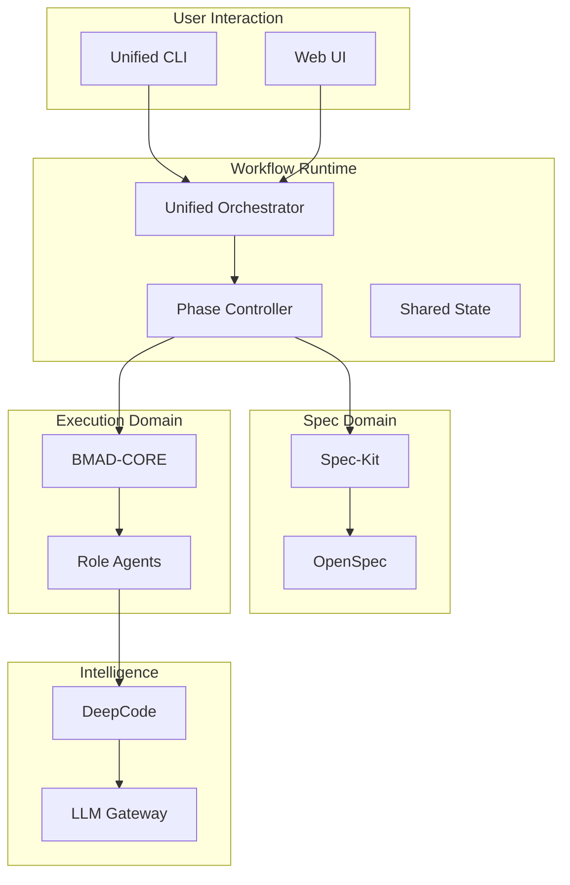

# Unified Spec‑Driven AI Engineering Architecture v2

> **目标**：将 Spec‑Kit、OpenSpec、BMAD‑Method、DeepCode 四套体系整合为一套**可实现、可治理、可演进**的 AI 工程系统，用于真实复杂软件与系统研发，而不是 Demo 级 Prompt 工程。

---

## 1. 设计原则（必须遵守）

1. **Spec First**：任何代码之前，必须存在 Spec
2. **Phase 强约束**：系统运行在 Phase 0–5 状态机内，不允许跳跃
3. **职责单一**：
   - 写规范 ≠ 写代码
   - 推理代码 ≠ 生成需求
4. **可回放、可审计**：所有决策进入 Event Store

---

## 2. 四大系统的工程级定位

### 2.1 Spec‑Kit（需求与规范入口）

- **语言 / 技术**：Python
- **定位**：人类 → 机器 的需求与规范入口
- **核心能力**：
  - Slash Commands：`/specify` `/plan` `/tasks`
  - 结构化 Spec 生成（YAML / Markdown）

**允许做的事**
- 把自然语言转为结构化 Spec
- 维护 Spec 的版本与演进

**禁止做的事**
- 规划系统架构
- 写任何实现代码

---

### 2.2 OpenSpec（形式化规范引擎）

- **语言 / 技术**：Python
- **定位**：Spec 的“数学化 / 逻辑化”层
- **核心能力**：
  - 不变量（Invariant）
  - 前置 / 后置条件
  - 约束与失败条件

**输入**：Spec‑Kit 生成的 Spec
**输出**：Formal Spec（可验证）

**权限规则**
- 可修改 Spec
- 只读 Code
- 有权阻断 Phase 2

---

### 2.3 BMAD‑Method（多角色执行系统）

- **语言 / 技术**：Node.js
- **定位**：AI 工程执行团队

**核心角色**
- PM：拆解目标与范围
- Architect：架构设计
- DEV：实现
- QA / TEA：验证与教学

**能力**
- Scale‑Adaptive Workflow（L0–L4）
- 多 Agent 协作

**边界**
- Spec：只读
- Code：可写

---

### 2.4 DeepCode（语义级代码推理）

- **语言 / 技术**：Python / C++ / ML
- **定位**：代码的“逻辑审计员”

**做什么**
- 验证代码是否满足 Formal Spec
- 发现语义错误、隐性逻辑漏洞

**不做什么**
- 不生成需求
- 不做架构设计

---

## 3. Phase 0–5 工作流（强制状态机）

### Phase 0 – Intent Capture
- 工具：Spec‑Kit `/specify`
- 产物：Intent Spec

### Phase 1 – Formal Specification
- 工具：OpenSpec
- 产物：Formal Spec

### Phase 2 – Architecture & Planning
- 工具：BMAD（PM / Architect）
- 产物：Plan / Architecture

### Phase 3 – Implementation
- 工具：BMAD‑DEV + DeepCode
- 产物：Code

### Phase 4 – Verification
- 工具：DeepCode + OpenSpec
- 产物：Verification Report

### Phase 5 – Iteration
- 基于 Event Store 回放
- 回到 Phase 1 或 3

---

## 4. 最终统一架构图（Mermaid）



---

## 5. 硬边界与权限规则（不可破坏）

| 模块 | Spec | Code | Phase Control |
|----|----|----|----|
| Spec‑Kit | RW | ❌ | ❌ |
| OpenSpec | RW | R | 可阻断 |
| BMAD | R | RW | ❌ |
| DeepCode | R | R | ❌ |

---

## 6. 推荐目录结构（可直接建 Repo）

```
/spec
  intent.yaml
  formal.yaml
/plan
  architecture.md
/code
  src/
/verification
  deepcode_report.md
/events
  phase_events.log
```

---

## 7. 这套架构解决了什么

- AI 不再“想当然写代码”
- Spec 不再是 Prompt
- 错误可以被证明
- 决策可以回放

---

> **结论**：
> 这是一个可以支撑「真实软件工程」而不是「AI Demo」的架构。

