# SpecKit-BMAD 完整工作原理图

**文档版本**: 1.0  
**更新日期**: 2025-01-27  
**适用范围**: 项目整体架构与工作流程

---

## 📋 目录

1. [系统整体架构](#系统整体架构)
2. [命令执行流程](#命令执行流程)
3. [工作流执行流程](#工作流执行流程)
4. [Agent 系统架构](#agent-系统架构)
5. [LLM 集成架构](#llm-集成架构)
6. [数据流图](#数据流图)
7. [文件系统结构](#文件系统结构)
8. [关键组件交互](#关键组件交互)
9. [初始化与配置流程](#初始化与配置流程)
10. [代码生成流程](#代码生成流程)

---

## 系统整体架构

### 架构层次图

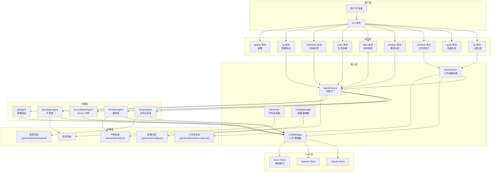

### 核心组件说明

| 组件 | 职责 | 关键文件 |
|------|------|---------|
| **CLI 入口** | 命令解析与路由 | `src/index.ts` |
| **Orchestrator** | 工作流编排、依赖解析、状态管理 | `src/workflow/orchestrator.ts` |
| **AgentFactory** | 代理注册与实例化 | `src/agents/factory.ts` |
| **LLMManager** | LLM 客户端管理与初始化 | `src/core/llm/manager.ts` |
| **Generator** | 项目代码生成 | `src/generator/index.ts` |
| **ConfigManager** | 配置加载与验证 | `src/utils/config.ts` |

---

## 命令执行流程

### 完整命令执行流程图

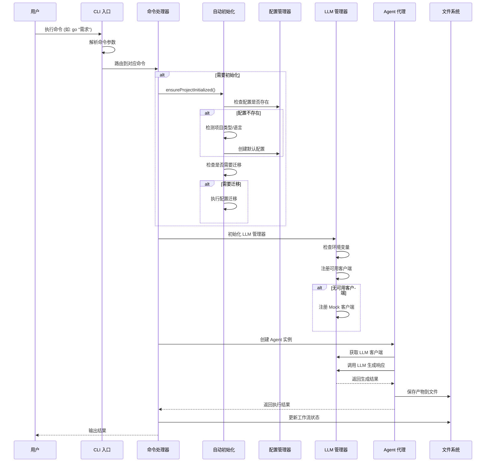

### 关键命令流程

#### 1. `go` 命令（一键生成）

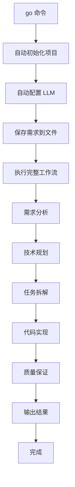

#### 2. `quick` 命令（快速生成）

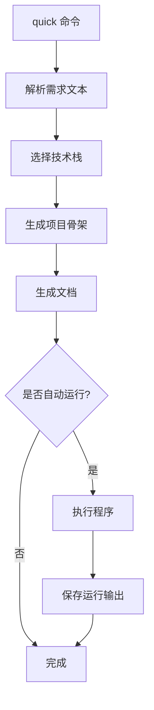

#### 3. `workflow` 命令（工作流执行）

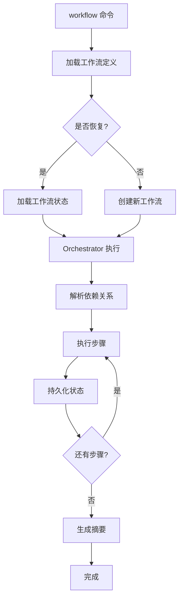

---

## 工作流执行流程

### Orchestrator 工作流程

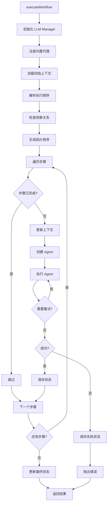

### 依赖解析算法

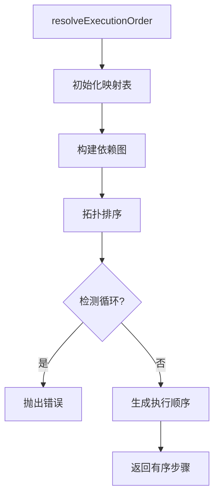

### 状态持久化

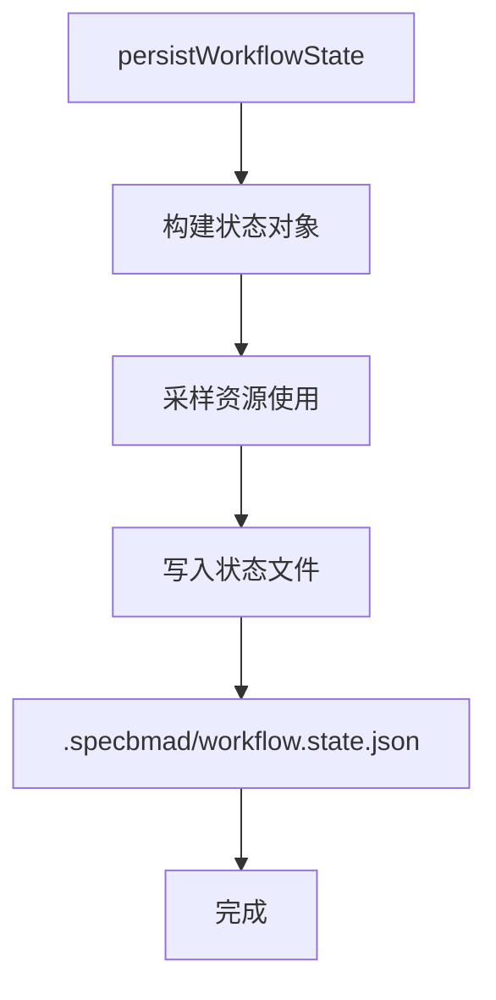

---

## Agent 系统架构

### Agent 层次结构

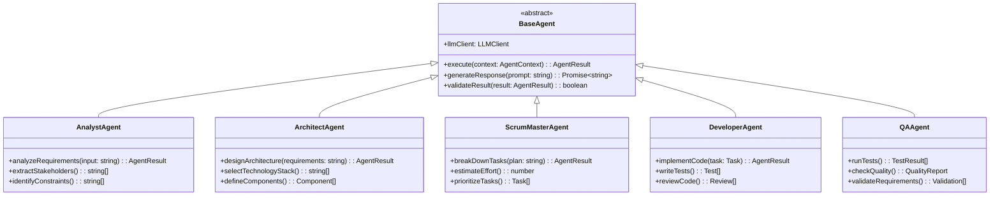

### Agent 执行流程

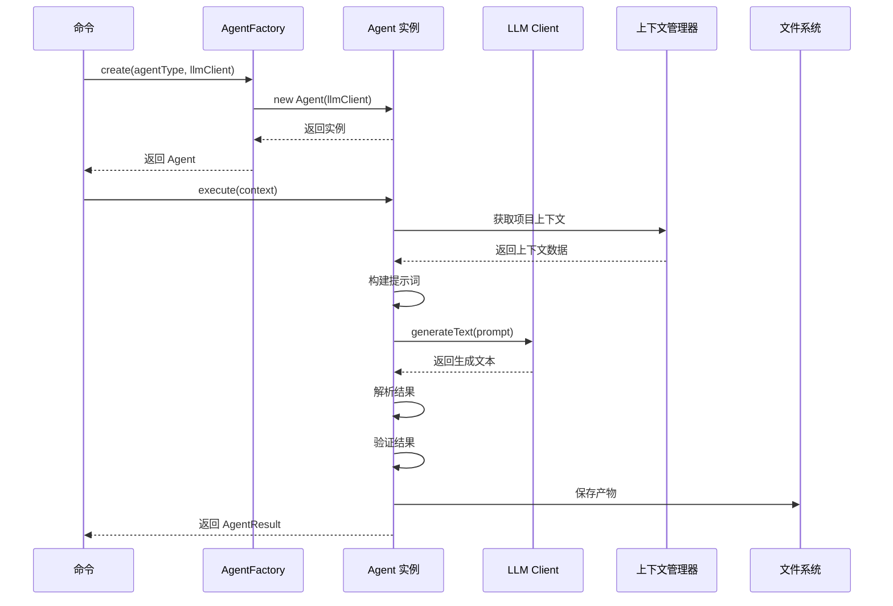

### Agent 注册机制

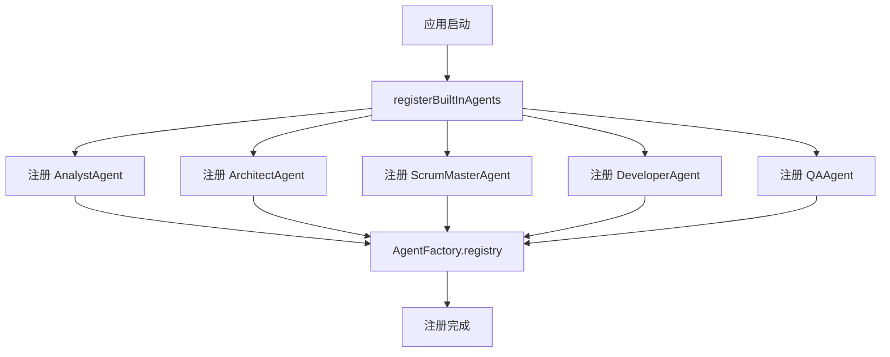

---

## LLM 集成架构

### LLM 客户端层次

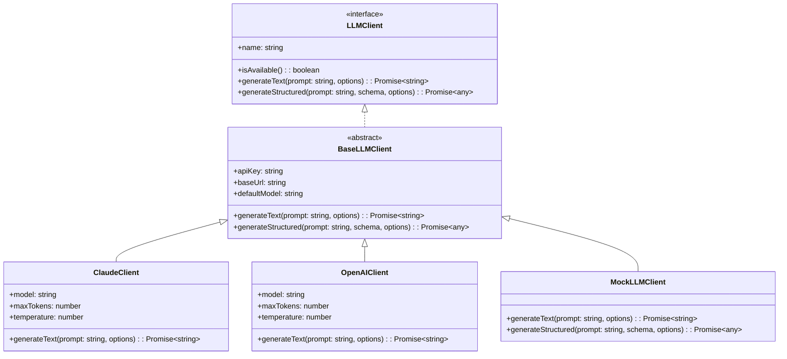

### LLM 管理器初始化流程

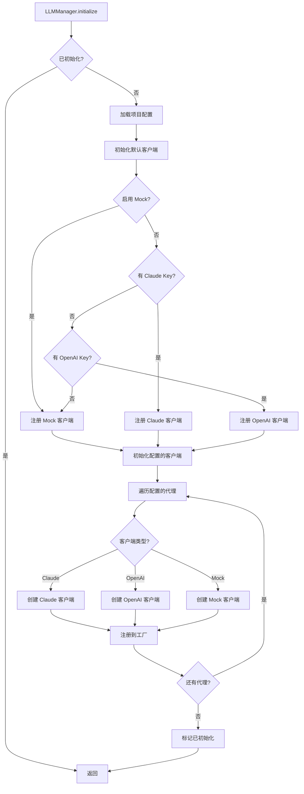

### LLM 调用流程

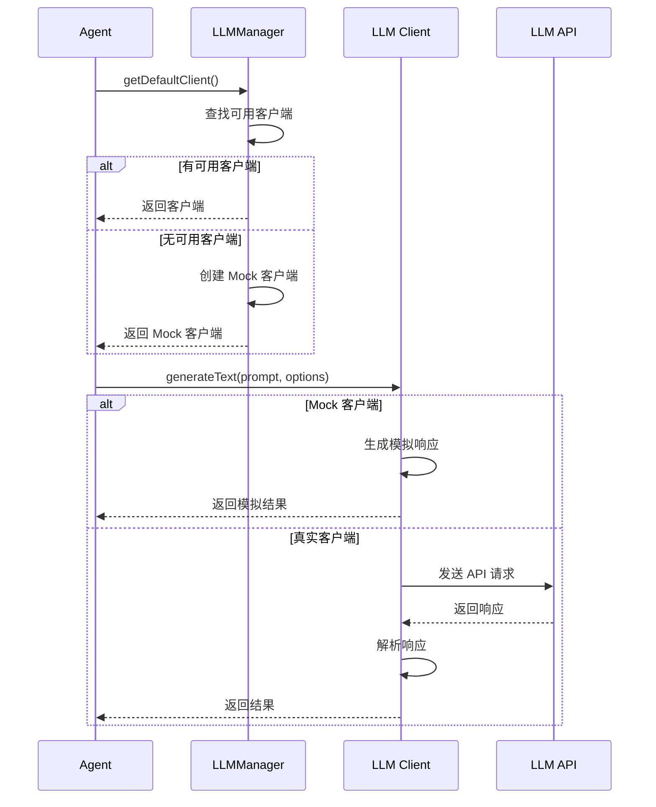

---

## 数据流图

### 完整数据流

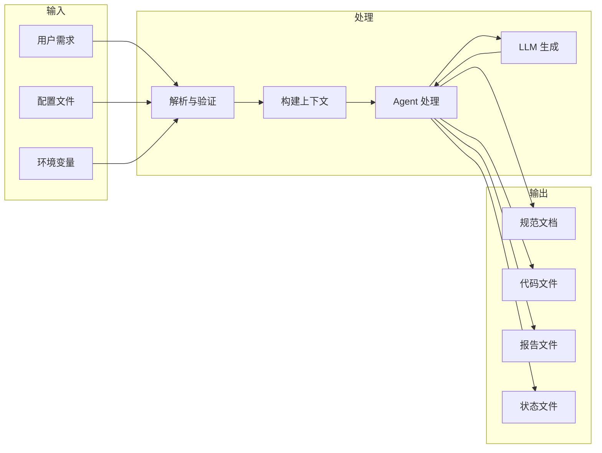

### 上下文数据流

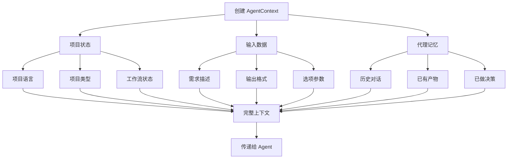

---

## 文件系统结构

### 项目目录结构

```
项目根目录/
├── .specbmad/                    # 主配置目录
│   ├── config.json               # 项目配置文件
│   ├── workflow.state.json       # 工作流状态
│   ├── chain.state.json          # 链式执行状态
│   ├── status.json               # 项目状态
│   ├── artifacts/                # 产物目录
│   │   ├── requirements.md       # 需求文档
│   │   ├── analysis.md           # 分析报告
│   │   ├── plan.md               # 技术方案
│   │   ├── tasks.md              # 任务列表
│   │   ├── implementation.md     # 实现报告
│   │   └── qa-report.md          # QA 报告
│   ├── specifications/           # 规范文档
│   │   └── *.md                  # 各种规范文档
│   ├── cache/                    # 缓存目录
│   └── releases/                 # 发布目录
├── generated/                    # 生成的代码
│   └── project/                  # 项目代码
│       ├── src/                  # 源代码
│       ├── tests/                # 测试代码
│       └── package.json          # 项目配置
├── docs/                         # 文档目录
│   ├── 项目说明书.md
│   └── run-output.txt
├── templates/                    # 模板目录
└── package.json                  # 工具配置
```

### 文件生成流程

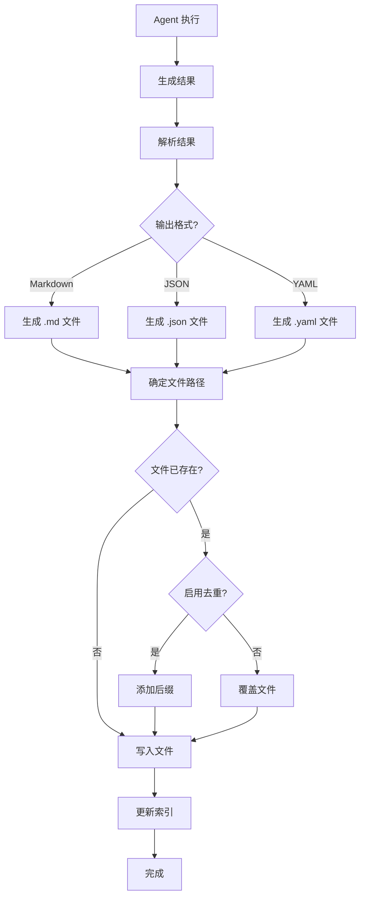

---

## 关键组件交互

### 完整交互序列图

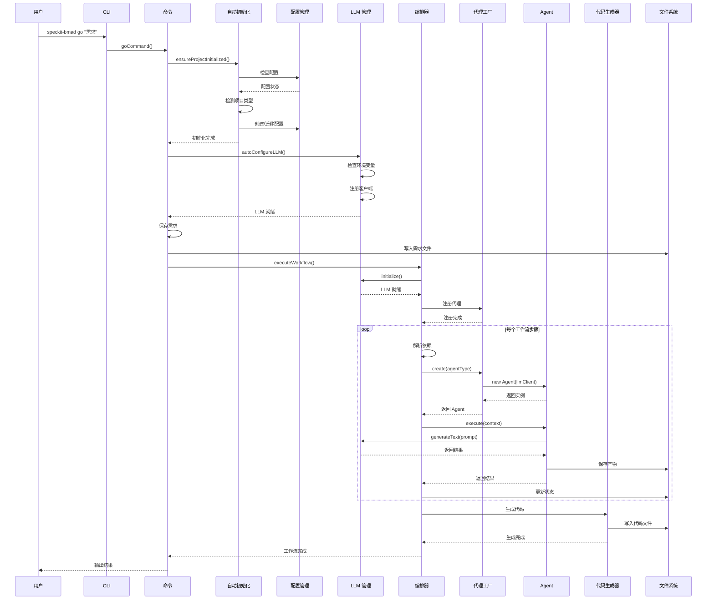

---

## 初始化与配置流程

### 自动初始化流程

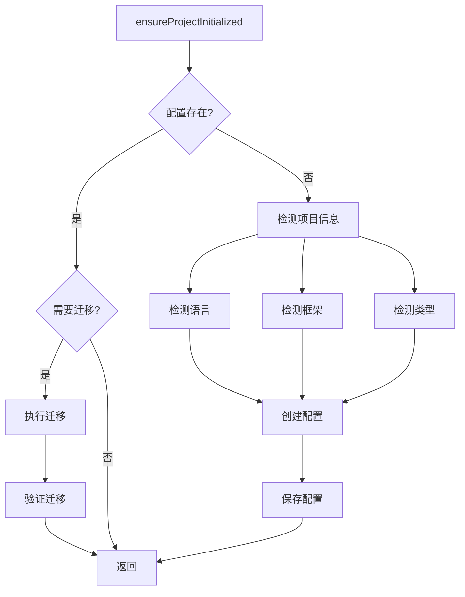

### 配置检测逻辑

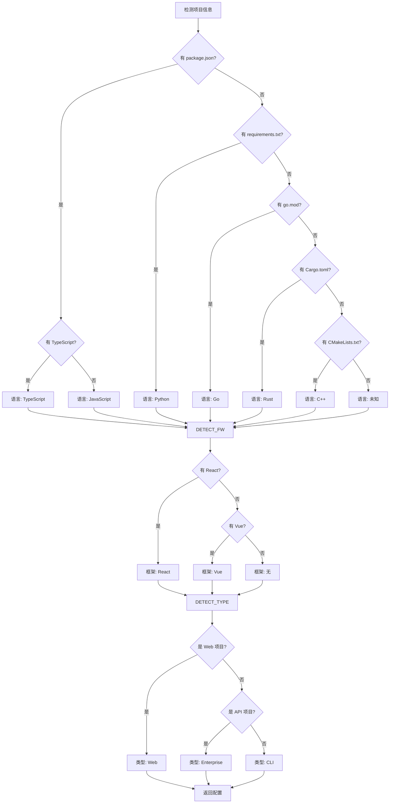

---

## 代码生成流程

### 代码生成器工作流程

```mermaid
flowchart TD
    START[generateByStack] --> CHECK_MANIFEST{有模板清单?}
    CHECK_MANIFEST -->|是| LOAD_MANIFEST[加载清单]
    CHECK_MANIFEST -->|否| CHECK_STACK{技术栈类型?}
    
    LOAD_MANIFEST --> APPLY[应用模板]
    APPLY --> INTERPOLATE[变量插值]
    INTERPOLATE --> WRITE[写入文件]
    
    CHECK_STACK -->|ts-app| GEN_TS[生成 TypeScript 应用]
    CHECK_STACK -->|py-lib| GEN_PY[生成 Python 库]
    CHECK_STACK -->|cpp-cli| GEN_CPP[生成 C++ CLI]
    CHECK_STACK -->|其他| GEN_DEFAULT[生成默认模板]
    
    GEN_TS --> CREATE_FILES[创建文件]
    GEN_PY --> CREATE_FILES
    GEN_CPP --> CREATE_FILES
    GEN_DEFAULT --> CREATE_FILES
    
    CREATE_FILES --> WRITE
    WRITE --> END[完成]
```

### 模板应用流程

```mermaid
sequenceDiagram
    participant Gen as Generator
    participant Manifest as 模板清单
    participant Template as 模板引擎
    participant FS as 文件系统
    
    Gen->>Manifest: loadManifest(stack, template)
    Manifest-->>Gen: 返回清单数据
    
    loop 每个文件模板
        Gen->>Template: interpolate(path, vars)
        Template-->>Gen: 返回插值后的路径
        Gen->>Template: interpolate(content, vars)
        Template-->>Gen: 返回插值后的内容
        Gen->>FS: writeFile(path, content)
        FS-->>Gen: 文件已写入
    end
    
    Gen-->>Gen: 生成完成
```

---

## 总结

### 核心设计原则

1. **模块化设计**: 各组件职责清晰，低耦合高内聚
2. **可扩展性**: 通过工厂模式支持新 Agent 和 LLM 客户端
3. **容错性**: Mock 模式支持离线使用，自动降级
4. **状态管理**: 工作流状态持久化，支持恢复
5. **自动化**: 自动初始化、自动配置、自动检测

### 关键数据流

1. **用户输入** → **命令解析** → **工作流编排** → **Agent 执行** → **LLM 生成** → **文件输出**
2. **配置加载** → **LLM 初始化** → **Agent 注册** → **上下文构建** → **执行** → **状态更新**

### 扩展点

1. **新增 Agent**: 继承 `BaseAgent`，在 `registerBuiltInAgents` 中注册
2. **新增 LLM**: 实现 `LLMClient` 接口，在 `LLMManager` 中注册
3. **新增命令**: 在 `src/index.ts` 中注册，实现命令处理函数
4. **新增模板**: 在 `src/generator/templates/` 中添加模板清单

---

**参考文档**:
- [系统流程与架构图](./系统流程与架构图.md)
- [技术规范与架构设计](./技术规范与架构设计.md)
- [CLI 使用说明](./CLI%20使用说明.md)

