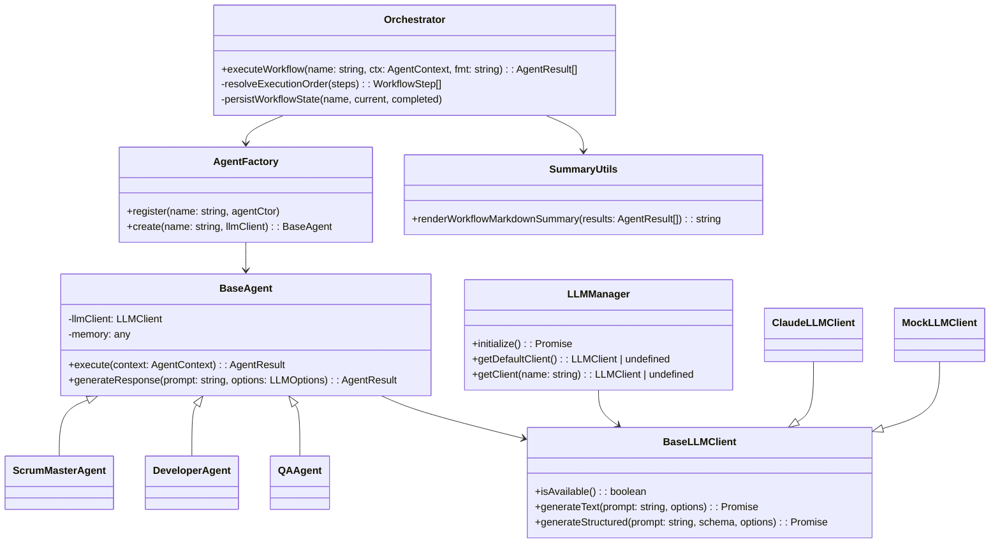

# 系统流程与架构图

本文件提供项目整体流程（输入→处理→输出）的流转图，以及核心类关系图，以帮助理解 CLI、工作流编排、Agent 与 LLM 的协作机制。

## 总体流程（Flowchart）

```mermaid
flowchart TD
  U[用户] --> C[CLI入口: dist/index.js]
  C -->|解析命令| CMD[具体命令: analyze/plan/implement/qa/workflow]
  CMD -->|加载配置| CFG[项目配置: .specbmad/config.json]
  CMD -->|初始化| LM[LLMManager]
  LM -->|注册默认/Mock客户端| LLM[(LLM Client)]
  CMD -->|编排执行| ORC[Orchestrator]
  ORC -->|注册内置代理| AF[AgentFactory]
  AF -->|实例化| AG[具体Agent: ScrumMaster/Developer/QA]
  AG -->|生成响应| LLM
  AG -->|写产物/更新内存| ART[产物/摘要]
  ORC -->|持久化| STATE[.bmad/workflow.state.json]
  CMD -->|输出| OUT[控制台/文件(.bmad/*.md|*.json)]

  subgraph 输出产物
    ART
    STATE
    OUT
  end
```

### 说明
- CLI通过 `commander` 路由到具体命令，命令内部统一使用 `LLMManager` 初始化客户端。
- `Orchestrator` 负责工作流步骤的依赖解析与顺序执行，持久化状态到 `.bmad/workflow.state.json`。
- `AgentFactory` 注册并创建具体 Agent；`Implementation` 别名解析到 `DeveloperAgent`。
- 产物与摘要由命令或工具函数（如 `renderWorkflowMarkdownSummary`）写入到 `.bmad/` 目录。

## 核心类图（Class Diagram）



### 说明
- `Orchestrator` 协调工作流和状态持久化；依赖 `AgentFactory` 与 `LLMManager`。
- `LLMManager` 管理可用客户端（默认与 Mock）；`MockLLMClient` 支持离线演示与测试。
- `DeveloperAgent` 处理实施步骤；`ScrumMasterAgent` 负责计划/拆解；`QAAgent` 负责验证。
- `SummaryUtils` 提供汇总渲染函数用于报告输出。

## 参考
- 源代码位置：`src/workflow/orchestrator.ts`、`src/agents/*`、`src/core/llm/*`、`src/utils/summary.ts`
- 配置文件说明：`docs/Agent配置文件说明.md`
- CLI 命令入口：`src/index.ts`