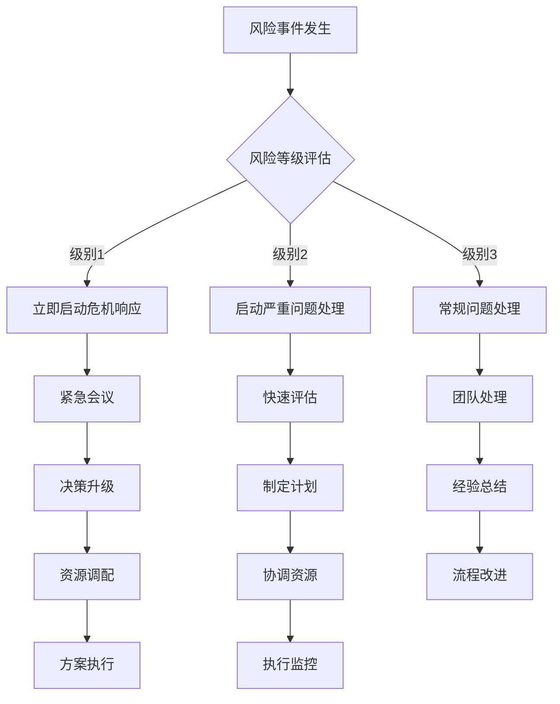

# Spec-Kit & BMAD-Method 整合项目风险评估与缓解策略

## 🎯 风险管理概述

### 风险管理目标
1. **主动识别**: 提前发现潜在风险和威胁
2. **量化评估**: 科学评估风险概率和影响程度
3. **制定策略**: 针对性制定预防缓解措施
4. **持续监控**: 动态跟踪风险状态变化
5. **快速响应**: 建立高效的风险应对机制

### 风险分类体系
```
项目风险分类
├── 技术风险 (Technical Risks)
│   ├── 架构复杂性风险
│   ├── 技术选型风险
│   ├── 集成兼容性风险
│   └── 性能达标风险
├── 资源风险 (Resource Risks)
│   ├── 人力资源风险
│   ├── 时间资源风险
│   ├── 预算资源风险
│   └── 基础设施风险
├── 外部风险 (External Risks)
│   ├── 第三方依赖风险
│   ├── 市场环境风险
│   ├── 政策法规风险
│   └── 竞争对手风险
└── 管理风险 (Management Risks)
    ├── 沟通协调风险
    ├── 需求变更风险
    ├── 质量控制风险
    └── 项目治理风险
```

### 风险评估矩阵
```
影响程度 vs 发生概率

        低概率  中概率  高概率
高影响    🟡     🔴     🔴
中影响    🟢     🟡     🔴  
低影响    🟢     🟢     🟡

🔴 高风险 - 需要立即制定详细缓解计划
🟡 中风险 - 需要监控并准备应对措施
🟢 低风险 - 定期评估，必要时采取行动
```

## 🔴 高风险项详细分析

### 1. AI代理系统复杂度风险

#### 风险描述
AI代理系统涉及多个智能代理的协作，包括复杂的工作流编排、状态管理和错误处理机制，系统复杂度可能超出预期。

#### 风险评估
- **发生概率**: 70% (高)
- **影响程度**: 高 (可能导致3-4周延期)
- **风险等级**: 🔴 高风险

#### 具体风险点
```
技术复杂性:
├── 多Agent协作逻辑复杂
├── 状态同步和一致性问题
├── 错误传播和恢复机制
└── 性能优化挑战

开发挑战:
├── 调试困难度高
├── 测试用例设计复杂
├── 集成测试覆盖面广
└── 文档维护工作量大
```

#### 缓解策略

**预防措施**:
```typescript
// 1. 采用分层架构设计
interface AgentLayer {
  presentation: CLIInterface;
  orchestration: WorkflowEngine;
  business: AgentManager;
  data: StateManager;
}

// 2. 实现Agent接口标准化
interface StandardAgent {
  id: string;
  name: string;
  version: string;
  execute(context: ExecutionContext): Promise<AgentResult>;
  validate(input: AgentInput): ValidationResult;
  rollback(context: ExecutionContext): Promise<void>;
}

// 3. 建立状态管理规范
class StateManager {
  async saveCheckpoint(agentId: string, state: AgentState): Promise<void>;
  async restoreCheckpoint(agentId: string): Promise<AgentState>;
  async clearCheckpoints(workflowId: string): Promise<void>;
}
```

**监控指标**:
- Agent执行成功率 > 95%
- 平均执行时间 < 30秒
- 内存使用 < 200MB
- 错误恢复时间 < 5秒

**应急计划**:
1. **简化版本**: 如果复杂度过高，先实现基础版本
2. **分阶段交付**: 将复杂功能拆分为多个迭代
3. **外部支持**: 寻求AI/ML专家技术支持
4. **技术替代**: 考虑使用成熟的工作流引擎

---

### 2. LLM API稳定性和成本风险

#### 风险描述
项目依赖第三方LLM服务（OpenAI、Anthropic等），存在API稳定性问题和成本超支风险。

#### 风险评估
- **发生概率**: 60% (中高)
- **影响程度**: 高 (影响核心功能可用性)
- **风险等级**: 🔴 高风险

#### 具体风险点
```
API稳定性:
├── 服务中断或限流
├── API版本变更
├── 响应时间不稳定
└── 错误率波动

成本控制:
├── Token使用量超预期
├── API调用频率过高
├── 高级模型成本昂贵
└── 预算控制困难
```

#### 缓解策略

**1. 智能LLM客户端 (Intelligent LLM Client)**

为了实现高可用和成本效益，我们将构建一个智能LLM客户端，它集成了重试、故障转移、负载均衡和缓存功能。

```typescript
// 增强的LLM客户端管理器
class IntelligentLLMClient {
  private providers: LLMProvider[];
  private healthMonitor: APIHealthMonitor;
  private cache: ICache; // Redis或内存缓存

  constructor(providers: LLMProvider[], healthMonitor: APIHealthMonitor, cache: ICache) {
    this.providers = providers;
    this.healthMonitor = healthMonitor;
    this.cache = cache;
  }

  async call(request: LLMRequest, options: { useCache: boolean } = { useCache: true }): Promise<LLMResponse> {
    const cacheKey = this.generateCacheKey(request);
    if (options.useCache) {
      const cachedResponse = await this.cache.get(cacheKey);
      if (cachedResponse) {
        return cachedResponse;
      }
    }

    const response = await this.tryCallWithFallbackAndRetry(request);
    
    if (options.useCache) {
      await this.cache.set(cacheKey, response, { ttl: 3600 }); // 缓存1小时
    }
    
    return response;
  }

  private async tryCallWithFallbackAndRetry(request: LLMRequest, maxRetries: number = 3): Promise<LLMResponse> {
    const healthyProviders = this.healthMonitor.getHealthyProviders();
    if (healthyProviders.length === 0) {
      throw new Error("All LLM providers are unhealthy.");
    }

    // 策略：优先使用性能最好、成本最低的健康提供商
    const provider = this.selectOptimalProvider(healthyProviders, request);

    for (let attempt = 1; attempt <= maxRetries; attempt++) {
      try {
        return await provider.call(request);
      } catch (error) {
        if (this.isTransientError(error) && attempt < maxRetries) {
          const delay = this.getExponentialBackoff(attempt);
          await new Promise(res => setTimeout(res, delay));
          console.warn(`Attempt ${attempt} failed for ${provider.name}. Retrying in ${delay}ms...`);
        } else {
          // 触发故障转移
          this.healthMonitor.reportFailure(provider.name);
          return this.tryCallWithFallbackAndRetry(request, 1); // 切换到下一个提供商，重置重试次数
        }
      }
    }
    throw new Error(`All retries and fallbacks failed for request.`);
  }
  
  private selectOptimalProvider(providers: LLMProvider[], request: LLMRequest): LLMProvider {
    // TODO: 实现基于延迟、成本和模型能力的动态选择逻辑
    return providers[0];
  }

  private isTransientError(error: any): boolean {
    // 识别可重试的错误，如429 (Too Many Requests), 5xx (Server Errors)
    const transientStatusCodes = [429, 500, 502, 503, 504];
    return transientStatusCodes.includes(error.statusCode);
  }

  private getExponentialBackoff(attempt: number): number {
    return Math.pow(2, attempt) * 100; // 100ms, 200ms, 400ms...
  }

  private generateCacheKey(request: LLMRequest): string {
    // 基于请求内容生成唯一的缓存键
    const hash = crypto.createHash('sha256');
    hash.update(JSON.stringify(request));
    return `llm:${hash.digest('hex')}`;
  }
}
```

**2. 精细化成本治理 (Granular Cost Governance)**

成本控制需要从预算、监控和优化三个维度进行。

```typescript
// 增强的成本控制器
class AdvancedCostController {
  private budgets: Map<string, { limit: number, usage: number }> = new Map(); // key: "global" | "project:<id>" | "user:<id>"

  constructor() {
    this.budgets.set("global", { limit: 1000, usage: 0 }); // 全局月预算 $1000
  }

  public setBudget(scope: string, limit: number) {
    this.budgets.set(scope, { limit, usage: 0 });
  }

  public async canExecute(request: LLMRequest, scope: string[]): Promise<boolean> {
    const estimatedCost = this.estimateCost(request);
    for (const s of scope) {
      const budget = this.budgets.get(s);
      if (budget && (budget.usage + estimatedCost) > budget.limit) {
        // 触发告警或请求节流
        this.handleBudgetExceeded(s, budget);
        return false;
      }
    }
    return true;
  }

  public recordCost(request: LLMRequest, response: LLMResponse, scope: string[]) {
    const actualCost = this.calculateCost(request, response);
    for (const s of scope) {
      const budget = this.budgets.get(s);
      if (budget) {
        budget.usage += actualCost;
      }
    }
  }

  private estimateCost(request: LLMRequest): number {
    // TODO: 基于模型、输入长度和预估输出长度进行成本估算
    return 0.01; // 示例估算
  }
  
  private calculateCost(request: LLMRequest, response: LLMResponse): number {
    // TODO: 基于提供商的计费标准和实际Token使用量精确计算
    return 0.01;
  }

  private handleBudgetExceeded(scope: string, budget: any) {
    console.error(`Budget exceeded for scope: ${scope}. Limit: ${budget.limit}, Usage: ${budget.usage}`);
    // TODO: 发送告警，或将高成本请求放入延迟队列
  }
}
```

**3. 全面监控与告警 (Comprehensive Monitoring & Alerting)**

我们将监控以下关键指标，并设置相应的告警阈值。

| 指标 (Metric) | 描述 | 阈值示例 | 告警级别 |
| :--- | :--- | :--- | :--- |
| **P95 Latency** | 95%的请求响应时间 | > 3s | Warning |
| **Error Rate** | 错误请求百分比 | > 5% (in 5 min) | Critical |
| **Provider Health** | 提供商健康检查失败率 | > 20% | Critical |
| **Token Usage** | 每分钟/每小时Token消耗量 | > 1M tokens/hr | Info |
| **Cost per Hour** | 每小时API成本 | > $10/hr | Warning |
| **Budget Usage** | 预算使用率 | > 80% | Warning |
| **Cache Hit Rate** | 缓存命中率 | < 30% | Warning |

**4. 缓存策略 (Caching Strategy)**

- **实现**: 使用Redis作为分布式缓存，以支持多实例部署。
- **缓存内容**: 缓存完整的`LLMResponse`对象。
- **缓存键**: 基于`LLMRequest`的内容（模型、Prompt、参数）生成SHA256哈希值作为缓存键。
- **失效策略**:
  - 默认TTL（Time-To-Live）为1小时。
  - 对于需要实时性的请求（如分析最新代码），可禁用缓存。
  - 当相关源数据（如被分析的文件）发生变化时，应主动使相关缓存失效。

**5. 请求优化策略 (Request Optimization Strategy)**

- **模型选择**:
  - **任务分类**: 根据任务的复杂性（如代码生成 vs. 文本摘要）选择不同能力的模型。
  - **成本效益**: 优先使用成本更低的模型（如GPT-3.5-Turbo），仅在必要时升级到GPT-4。
- **Prompt工程**:
  - **精简上下文**: 移除不必要的上下文信息，减少输入Token。
  - **指令优化**: 使用更精确、简洁的指令。
  - **Few-shot示例**: 优化few-shot示例的数量和内容。
- **批处理与流式处理**:
  - **批处理**: 将多个相似的请求合并为一个批处理请求，以减少API调用开销。
  - **流式响应 (Streaming)**: 对需要实时反馈的场景，使用流式API以降低首字节响应时间并改善用户体验。

**应急预案**:
1. **本地模型备份**: 部署开源LLM作为最后备选
2. **缓存策略**: 实现智能缓存减少API调用
3. **降级服务**: 在成本超标时提供基础功能
4. **预算告警**: 设置多级预算告警机制

---

### 3. 性能达标风险

#### 风险描述
系统性能可能无法满足用户期望，特别是在处理大型项目或复杂工作流时。

#### 风险评估
- **发生概率**: 50% (中)
- **影响程度**: 高 (严重影响用户体验)
- **风险等级**: 🔴 高风险

#### 具体风险点
```
响应时间:
├── CLI命令执行缓慢
├── LLM API调用延迟
├── 文件I/O操作耗时
└── 复杂计算处理慢

资源使用:
├── 内存使用过高
├── CPU占用率高
├── 磁盘空间不足
└── 网络带宽限制

并发处理:
├── 多任务并发能力差
├── 资源竞争问题
├── 死锁和阻塞
└── 扩展性不足
```

#### 缓解策略

**性能优化架构**:
```typescript
// 1. 异步处理框架
class AsyncTaskManager {
  private taskQueue: Queue<Task> = new Queue();
  private workerPool: WorkerPool;
  
  constructor(maxWorkers: number = 4) {
    this.workerPool = new WorkerPool(maxWorkers);
  }
  
  async executeTask<T>(task: Task): Promise<T> {
    return new Promise((resolve, reject) => {
      this.taskQueue.enqueue({
        ...task,
        resolve,
        reject,
        timestamp: Date.now()
      });
      
      this.processQueue();
    });
  }
  
  private async processQueue(): Promise<void> {
    if (this.taskQueue.isEmpty() || this.workerPool.isFull()) {
      return;
    }
    
    const task = this.taskQueue.dequeue();
    const worker = await this.workerPool.getWorker();
    
    worker.execute(task)
      .then(task.resolve)
      .catch(task.reject)
      .finally(() => this.workerPool.releaseWorker(worker));
  }
}

// 2. 缓存系统
class IntelligentCache {
  private cache: Map<string, CacheEntry> = new Map();
  private maxSize: number = 1000;
  private ttl: number = 3600000; // 1 hour
  
  async get<T>(key: string): Promise<T | null> {
    const entry = this.cache.get(key);
    
    if (!entry || this.isExpired(entry)) {
      this.cache.delete(key);
      return null;
    }
    
    entry.lastAccessed = Date.now();
    return entry.value as T;
  }
  
  async set<T>(key: string, value: T, customTTL?: number): Promise<void> {
    if (this.cache.size >= this.maxSize) {
      this.evictLRU();
    }
    
    this.cache.set(key, {
      value,
      createdAt: Date.now(),
      lastAccessed: Date.now(),
      ttl: customTTL || this.ttl
    });
  }
}

// 3. 流式处理
class StreamProcessor {
  async processLargeFile(filePath: string, processor: (chunk: string) => void): Promise<void> {
    const stream = fs.createReadStream(filePath, { encoding: 'utf8' });
    
    return new Promise((resolve, reject) => {
      stream.on('data', (chunk) => {
        try {
          processor(chunk);
        } catch (error) {
          reject(error);
        }
      });
      
      stream.on('end', resolve);
      stream.on('error', reject);
    });
  }
}
```

**性能监控**:
```typescript
class PerformanceMonitor {
  private metrics: Map<string, PerformanceMetric> = new Map();
  
  startTimer(operation: string): string {
    const timerId = `${operation}_${Date.now()}`;
    
    this.metrics.set(timerId, {
      operation,
      startTime: performance.now(),
      memoryStart: process.memoryUsage()
    });
    
    return timerId;
  }
  
  endTimer(timerId: string): PerformanceResult {
    const metric = this.metrics.get(timerId);
    if (!metric) {
      throw new Error(`Timer ${timerId} not found`);
    }
    
    const endTime = performance.now();
    const memoryEnd = process.memoryUsage();
    
    const result: PerformanceResult = {
      operation: metric.operation,
      duration: endTime - metric.startTime,
      memoryUsed: memoryEnd.heapUsed - metric.memoryStart.heapUsed,
      timestamp: new Date()
    };
    
    this.metrics.delete(timerId);
    this.recordMetric(result);
    
    return result;
  }
  
  private recordMetric(result: PerformanceResult): void {
    // 记录到监控系统
    if (result.duration > 5000) { // 超过5秒
      console.warn(`Slow operation detected: ${result.operation} took ${result.duration}ms`);
    }
  }
}
```

**性能基准和目标**:
```
响应时间目标:
├── CLI命令启动: < 1秒
├── 简单操作: < 3秒
├── 复杂工作流: < 30秒
└── LLM API调用: < 10秒

资源使用目标:
├── 内存使用: < 500MB
├── CPU使用: < 50%
├── 磁盘I/O: < 100MB/s
└── 网络带宽: < 10MB/s

并发处理目标:
├── 同时处理任务: ≥ 4个
├── 队列处理能力: ≥ 100任务/分钟
├── 响应时间稳定性: 变异系数 < 20%
└── 错误率: < 1%
```

---

## 🟡 中风险项分析

### 4. 团队协作和沟通风险

#### 风险描述
团队成员间的协作效率和沟通质量可能影响项目进度和质量。

#### 风险评估
- **发生概率**: 40% (中)
- **影响程度**: 中 (可能导致1-2周延期)
- **风险等级**: 🟡 中风险

#### 缓解策略

**协作机制建立**:
```markdown
## 团队协作规范

### 日常沟通
- 每日站会: 9:30 AM, 15分钟
- 周例会: 每周五下午, 1小时
- 技术讨论: 随时，Slack #tech-discussion

### 代码协作
- 分支策略: GitFlow
- 代码审查: 至少2人审查
- 合并要求: 通过CI/CD + 审查通过

### 文档协作
- 技术文档: 统一使用Markdown
- API文档: 自动生成 + 人工维护
- 会议纪要: 共享文档实时协作
```

**知识管理**:
```typescript
// 知识库结构
interface KnowledgeBase {
  architecture: {
    systemDesign: string;
    componentDiagram: string;
    dataFlow: string;
  };
  
  development: {
    codingStandards: string;
    bestPractices: string;
    troubleshooting: string;
  };
  
  operations: {
    deploymentGuide: string;
    monitoringSetup: string;
    emergencyProcedures: string;
  };
}
```

---

### 5. 第三方依赖风险

#### 风险描述
项目依赖多个第三方库和服务，存在版本兼容性、安全漏洞和服务中断风险。

#### 风险评估
- **发生概率**: 35% (中低)
- **影响程度**: 中 (可能影响功能稳定性)
- **风险等级**: 🟡 中风险

#### 缓解策略

**依赖管理策略**:
```json
// package.json 依赖锁定策略
{
  "dependencies": {
    "commander": "^9.4.1",
    "inquirer": "^8.2.5",
    "chalk": "^4.1.2",
    "axios": "^1.3.4"
  },
  "devDependencies": {
    "@types/node": "^18.15.0",
    "typescript": "^4.9.5",
    "jest": "^29.5.0"
  },
  "engines": {
    "node": ">=16.0.0",
    "npm": ">=8.0.0"
  }
}
```

**安全扫描自动化**:
```bash
#!/bin/bash
# scripts/security-audit.sh

echo "Running dependency security audit..."

# NPM audit
npm audit --audit-level moderate

# Snyk scan
npx snyk test

# Check for outdated packages
npm outdated

# License compliance check
npx license-checker --summary

echo "Security audit completed."
```

**依赖监控**:
```typescript
class DependencyMonitor {
  async checkForUpdates(): Promise<UpdateReport[]> {
    const outdated = await this.getOutdatedPackages();
    const security = await this.getSecurityVulnerabilities();
    
    return this.generateUpdateReport(outdated, security);
  }
  
  async validateLicenses(): Promise<LicenseReport> {
    const licenses = await this.scanLicenses();
    const incompatible = licenses.filter(l => 
      !this.isCompatibleLicense(l.license)
    );
    
    return {
      total: licenses.length,
      compatible: licenses.length - incompatible.length,
      incompatible: incompatible.length,
      issues: incompatible
    };
  }
}
```

---

### 6. 需求变更风险

#### 风险描述
项目需求可能在开发过程中发生变更，影响开发进度和资源分配。

#### 风险评估
- **发生概率**: 45% (中)
- **影响程度**: 中 (可能导致重新设计)
- **风险等级**: 🟡 中风险

#### 缓解策略

**需求管理流程**:
```markdown
## 需求变更控制流程

### 1. 需求提出
- 填写需求变更申请表
- 说明变更原因和预期收益
- 评估变更影响范围

### 2. 影响评估
- 技术影响评估
- 时间成本评估
- 资源需求评估
- 风险评估

### 3. 决策审批
- 项目经理初审
- 技术负责人评估
- 利益相关者决策
- 变更批准/拒绝

### 4. 变更实施
- 更新项目计划
- 调整资源分配
- 通知相关团队
- 跟踪变更进度
```

**需求追踪系统**:
```typescript
interface RequirementChange {
  id: string;
  title: string;
  description: string;
  requestor: string;
  priority: 'low' | 'medium' | 'high' | 'critical';
  impact: {
    technical: string;
    timeline: number; // days
    resources: string[];
    cost: number;
  };
  status: 'pending' | 'approved' | 'rejected' | 'implemented';
  approvals: Approval[];
  createdAt: Date;
  updatedAt: Date;
}

class RequirementManager {
  async submitChange(change: RequirementChange): Promise<string> {
    // 提交需求变更
    const changeId = await this.repository.save(change);
    
    // 通知相关人员
    await this.notificationService.notifyStakeholders(change);
    
    // 启动评估流程
    await this.startEvaluationProcess(changeId);
    
    return changeId;
  }
  
  async evaluateImpact(changeId: string): Promise<ImpactAssessment> {
    const change = await this.repository.findById(changeId);
    
    return {
      technicalImpact: await this.assessTechnicalImpact(change),
      timelineImpact: await this.assessTimelineImpact(change),
      resourceImpact: await this.assessResourceImpact(change),
      riskImpact: await this.assessRiskImpact(change)
    };
  }
}
```

---

## 🟢 低风险项监控

### 7. 开发工具和环境风险

#### 风险描述
开发工具链和环境配置可能出现兼容性问题或配置错误。

#### 风险评估
- **发生概率**: 20% (低)
- **影响程度**: 低 (主要影响开发效率)
- **风险等级**: 🟢 低风险

#### 监控措施
- 定期更新开发工具
- 维护环境配置文档
- 自动化环境检查脚本
- 团队环境标准化

---

### 8. 文档维护风险

#### 风险描述
项目文档可能滞后于代码更新，导致文档不准确或不完整。

#### 风险评估
- **发生概率**: 30% (低中)
- **影响程度**: 低 (主要影响维护效率)
- **风险等级**: 🟢 低风险

#### 监控措施
- 文档更新检查清单
- 自动化文档生成
- 代码审查包含文档检查
- 定期文档审核

---

## 📊 风险监控仪表板

### 风险状态追踪

```typescript
interface RiskDashboard {
  overview: {
    totalRisks: number;
    highRisks: number;
    mediumRisks: number;
    lowRisks: number;
    mitigatedRisks: number;
  };
  
  trends: {
    newRisksThisWeek: number;
    resolvedRisksThisWeek: number;
    riskTrendDirection: 'increasing' | 'stable' | 'decreasing';
  };
  
  alerts: {
    criticalAlerts: Alert[];
    warningAlerts: Alert[];
  };
  
  metrics: {
    riskMitigationRate: number; // %
    averageResolutionTime: number; // days
    riskImpactScore: number; // 1-10
  };
}

class RiskMonitor {
  async generateDashboard(): Promise<RiskDashboard> {
    const risks = await this.getAllRisks();
    const alerts = await this.getActiveAlerts();
    
    return {
      overview: this.calculateOverview(risks),
      trends: await this.calculateTrends(risks),
      alerts: this.categorizeAlerts(alerts),
      metrics: await this.calculateMetrics(risks)
    };
  }
  
  async checkRiskThresholds(): Promise<void> {
    const highRisks = await this.getHighRisks();
    
    for (const risk of highRisks) {
      if (risk.probability > 0.7 && risk.impact === 'high') {
        await this.triggerEmergencyResponse(risk);
      }
    }
  }
}
```

### 风险报告模板

```markdown
# 项目风险周报

## 📊 风险概览
- 总风险数: {{totalRisks}}
- 高风险: {{highRisks}} 🔴
- 中风险: {{mediumRisks}} 🟡  
- 低风险: {{lowRisks}} 🟢

## 🚨 本周新增风险
{{#newRisks}}
- **{{title}}** ({{level}})
  - 概率: {{probability}}%
  - 影响: {{impact}}
  - 负责人: {{owner}}
{{/newRisks}}

## ✅ 本周缓解风险
{{#mitigatedRisks}}
- **{{title}}** - {{mitigationAction}}
{{/mitigatedRisks}}

## ⚠️ 需要关注的风险
{{#watchRisks}}
- **{{title}}**
  - 当前状态: {{status}}
  - 下一步行动: {{nextAction}}
  - 截止日期: {{deadline}}
{{/watchRisks}}

## 📈 风险趋势分析
- 风险缓解率: {{mitigationRate}}%
- 平均解决时间: {{avgResolutionTime}}天
- 风险影响评分: {{impactScore}}/10

## 🎯 下周重点行动
{{#nextWeekActions}}
- {{action}} (负责人: {{owner}}, 截止: {{deadline}})
{{/nextWeekActions}}
```

---

## 🚨 应急响应计划

### 紧急情况分级

#### 级别1 - 项目危机 🔴
**触发条件**:
- 关键功能完全无法实现
- 项目延期超过4周
- 核心团队成员大量离职
- 预算超支超过50%

**响应措施**:
1. **立即召集**: 24小时内召集紧急会议
2. **决策升级**: 上报高层管理，寻求支持
3. **方案调整**: 重新评估项目可行性
4. **资源调配**: 紧急调配额外资源
5. **沟通透明**: 及时通知所有利益相关者

#### 级别2 - 严重问题 🟡
**触发条件**:
- 重要功能实现困难
- 项目延期1-3周
- 关键依赖服务中断
- 预算超支20-50%

**响应措施**:
1. **快速评估**: 48小时内完成影响评估
2. **制定计划**: 制定详细的解决方案
3. **资源协调**: 协调内部资源支持
4. **进度调整**: 调整项目计划和里程碑
5. **定期汇报**: 每日汇报解决进展

#### 级别3 - 一般问题 🟢
**触发条件**:
- 非关键功能问题
- 轻微进度延迟
- 小规模技术问题
- 预算轻微超支

**响应措施**:
1. **常规处理**: 按正常流程处理
2. **团队协作**: 团队内部协调解决
3. **经验总结**: 记录问题和解决方案
4. **预防改进**: 改进流程防止重复

### 应急联系人

```
紧急联系人列表:

项目经理: 张三
├── 电话: 138-0000-0001
├── 邮箱: pm@company.com
└── 微信: pm_zhang

技术负责人: 李四  
├── 电话: 138-0000-0002
├── 邮箱: tl@company.com
└── 微信: tl_li

产品负责人: 王五
├── 电话: 138-0000-0003
├── 邮箱: po@company.com
└── 微信: po_wang

运维负责人: 赵六
├── 电话: 138-0000-0004
├── 邮箱: ops@company.com
└── 微信: ops_zhao
```

### 应急决策流程



---

## 📋 风险管理检查清单

### 每日检查 ✅
- [ ] 检查CI/CD构建状态
- [ ] 监控API调用成功率
- [ ] 查看错误日志和告警
- [ ] 确认团队成员状态
- [ ] 检查预算使用情况

### 每周检查 ✅
- [ ] 更新风险状态
- [ ] 评估新识别的风险
- [ ] 检查缓解措施执行情况
- [ ] 分析风险趋势变化
- [ ] 更新应急预案

### 每月检查 ✅
- [ ] 全面风险评估
- [ ] 风险管理流程审查
- [ ] 应急预案演练
- [ ] 风险管理培训
- [ ] 经验教训总结

### 里程碑检查 ✅
- [ ] 风险影响评估
- [ ] 缓解策略有效性评估
- [ ] 应急预案更新
- [ ] 风险管理报告
- [ ] 下阶段风险规划

---

## 🎯 成功指标

### 风险管理KPI
```
风险识别率: ≥ 90%
├── 提前识别的风险占比
├── 风险预测准确率
└── 遗漏风险数量

风险缓解效果: ≥ 85%
├── 风险缓解成功率
├── 风险影响降低程度
└── 缓解措施执行率

响应时间: ≤ 24小时
├── 风险识别到响应时间
├── 应急预案启动时间
└── 问题解决平均时间

项目影响: ≤ 5%
├── 因风险导致的延期比例
├── 因风险导致的成本增加
└── 因风险导致的质量问题
```

### 持续改进机制
1. **定期回顾**: 每月风险管理回顾会议
2. **经验分享**: 风险案例库建设和分享
3. **流程优化**: 基于实践经验优化风险管理流程
4. **工具改进**: 持续改进风险监控和预警工具
5. **培训提升**: 定期开展风险管理培训

---

*本风险评估与缓解策略文档为Spec-Kit与BMAD-Method整合项目提供了全面的风险管理框架，确保项目能够有效识别、评估和应对各类风险，提高项目成功率。*

## 当前风险（更新）
- 参数不一致风险：TS 与 Python 端的 `type|depth|operation|output` 若未对齐，触发 `invalid choice`/`unknown option`
- 解释器不可用风险：目标环境仅有 `python3` 或路径异常，导致桥接失败
- 配置路径不一致：日志提示 `/.specbmad/config.json` 缺失，仓库仅存在 `/.specbmad.json`
- 产物结构漂移：Python 端字段命名变更，导致下游汇总或报告脚本解析失败
- 依赖与性能：多引擎初始化 + 跨语言调用带来额外资源开销

### 缓解措施（更新）
- 参数对齐治理：在 CLI 侧统一枚举与默认值，并在文档中明确；在桥接层做校验与提示
- 解释器回退策略：默认尝试 `python`，失败后回退 `python3`；在日志中明确输出实际使用解释器
- 配置路径兼容：TS 层读取 `/.specbmad/config.json` 与 `/.specbmad.json` 两者之一；同时制定迁移步骤
- 产物契约：建立 `.bmad/artifacts/*.json` 的关键字段契约，并在 `产物说明与汇总.md` 中维护
- 冒烟与门禁：以四条 CLI 冒烟用例作为质量门槛，脚本化校验产物存在与关键字段
- 报告工具：新增“报告/汇总”命令或脚本，统一产物解析与输出，降低漂移影响

### 风险监控与触发条件
- 连续两次 CLI 运行出现参数错误：触发参数治理任务
- 任一工作流产物缺失或关键字段为空：触发产物契约检查
- 日志中出现解释器不可用或配置路径错误：触发环境与配置检查
- 构建后运行时间较基线上升 >20%：触发性能回归分析